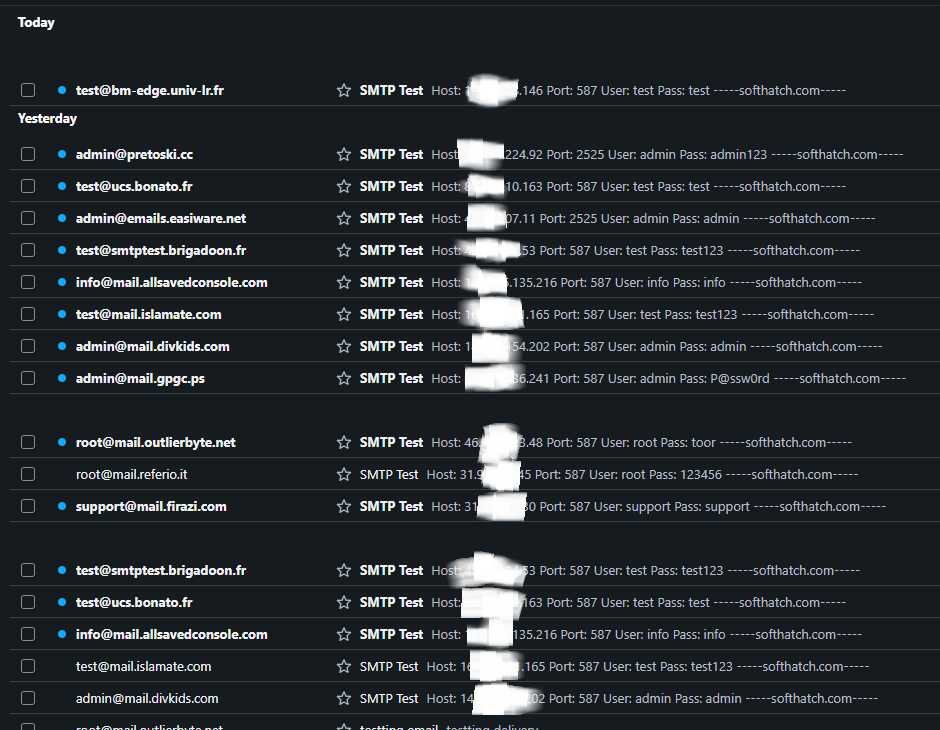
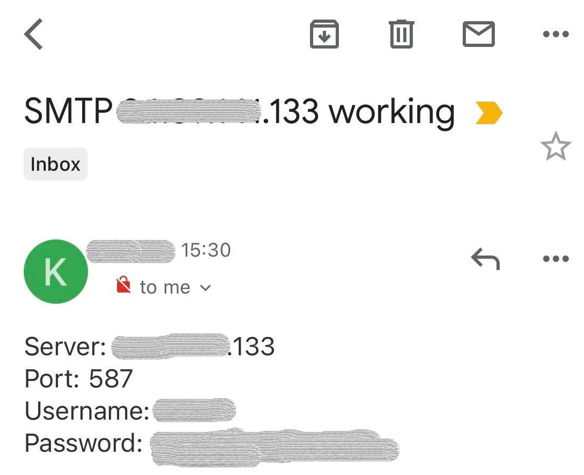

Saga SMTP Cracker is a multithreaded tool that tests SMTP servers with username:password combos and confirms success by sending real emails

<h2>🎬 Demo Video</h2>

<h2>🎬 Demo Video</h2>

  <a href="[https://www.youtube.com/watch?v=YOUR_VIDEO_ID](https://www.youtube.com/watch?v=v5On5Qqbyk8)">Watch Demo Video</a>

<h2>🎬 Demo Video</h2>

  <a href="https://odysee.com/@SoftHatch:5/Saga-Smtp-Cracker:1?src=embed">Watch Demo Video</a>

<h2>📬 Contact</h2>

  Send me a message for business inquiries, collaborations, or project discussions.

  💼 <strong>Teams:</strong> tranphucggg 
  📧 <strong>Email:</strong> <a href="mailto:tranphucggg@gmail.com">tranphucggg@gmail.com</a> 
  📱 <strong>Telegram:</strong> <a href="https://t.me/j_tran_ggg" target="_blank">@j_tran_ggg</a> 
  🆔 <strong>ID:</strong> j.tran

